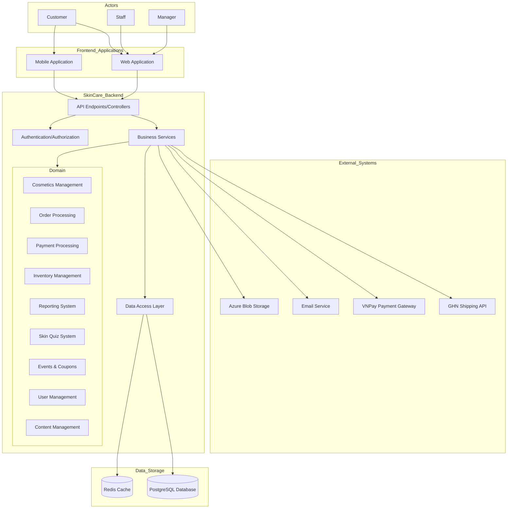

[](https://jenkins.pak160404.click/job/SWD_SkinCare/)
[](https://sonarqube.pak160404.click/dashboard?id=SWD_SkinCare)


## Table of Contents
- [Table of Contents](#table-of-contents)
- [Project Overview](#project-overview)
- [System Architecture](#system-architecture)
  - [System Context](#system-context)
- [Features](#features)
  - [Authentication and User Management](#authentication-and-user-management)
  - [Product Catalog](#product-catalog)
  - [Skin Quiz](#skin-quiz)
  - [Order Processing](#order-processing)
  - [Inventory Management](#inventory-management)
  - [Sales and Reporting](#sales-and-reporting)
  - [Promotions](#promotions)
  - [Content Management](#content-management)
  - [Customer Support](#customer-support)
- [Technology Stack](#technology-stack)
- [Setup Guide](#setup-guide)
  - [System Requirements](#system-requirements)
  - [Docker Setup](#docker-setup)
    - [Prerequisites](#prerequisites)
    - [Instructions](#instructions)
  - [Traditional Setup](#traditional-setup)
    - [Prerequisites](#prerequisites-1)
    - [Instructions](#instructions-1)
- [Database Management](#database-management)
  - [Using DBeaver](#using-dbeaver)
- [Troubleshooting](#troubleshooting)
- [API Documentation](#api-documentation)
- [External Integrations](#external-integrations)
- [Team](#team)
- [CI/CD](#cicd)

## Project Overview

The Skincare Backend is a .NET-based API that powers a skincare e-commerce platform. It includes comprehensive inventory management, order processing, user management, and product recommendation capabilities. The system follows a clean architecture approach with domain-driven design principles.

## System Architecture

The application follows a clean architecture pattern with these layers:

- **Domain Layer**: Core business entities and business rules
- **Application Layer**: Use cases, services, and interfaces
- **Infrastructure Layer**: Data persistence and external service integrations
- **Presentation Layer**: API controllers and endpoints

### System Context



## Features

### Authentication and User Management
- JWT-based authentication
- Role-based authorization (Customer, Staff, Manager)
- User profile management

### Product Catalog
- Product management with categories, brands, and types
- Image management with Azure Blob Storage
- Pricing with support for discounts and events

### Skin Quiz
- Interactive skin type assessment
- Product recommendations based on skin type
- Personalized skincare routines

### Order Processing
- Shopping cart functionality
- Multi-payment gateway integration (VNPay)
- Order status tracking
- Integration with GHN for shipping

### Inventory Management
- Batch tracking with expiration dates
- Stock management
- Low inventory alerts

### Sales and Reporting
- Revenue reports
- Product performance analytics
- Customer behavior analytics
- Export to multiple formats (PDF, Word)

### Promotions
- Event-based discounts
- Coupon management
- Promotional pricing

### Content Management
- Blog articles
- FAQs
- Product reviews and ratings

### Customer Support
- Chatwoot integration for live chat
- Support ticket management

## Technology Stack

- **Framework:** .NET 8.0
- **Database:** PostgreSQL 17
- **Caching:** Redis
- **ORM:** Entity Framework Core
- **Authentication:** JWT Tokens
- **Documentation:** Swagger/OpenAPI
- **Cloud Storage:** Azure Blob Storage
- **Payment Gateway:** VNPay
- **Shipping API:** GHN
- **Email Service:** SMTP Integration
- **Containerization:** Docker & Docker Compose

## Setup Guide

### System Requirements

- .NET 8.0 SDK
- PostgreSQL 17
- Redis (optional, for caching)
- Docker & Docker Compose (optional)

### Docker Setup

#### Prerequisites

- Docker installed
- Create a `.env` folder, then create `dbcon.env`:
  ```
  databaseConnectionString=Server=skincare.db;Database=skincare;User Id=admin;Password=secret;
  ```

#### Instructions

1. Disable any running PostgreSQL services on your machine.
2. Run `docker-compose up -d`
3. Access API at http://localhost:8080/swagger/index.html

### Traditional Setup

#### Prerequisites

- .NET 8.0 SDK installed
- PostgreSQL 17 installed and running

#### Instructions

1. Create a PostgreSQL database named `skincare`.
2. Update connection string in `appsettings.json`.
3. Apply database migrations:
   ```sh
   dotnet ef database update
   ```

## Database Management

### Using DBeaver

1. Click **New Database Connection** and select PostgreSQL.
2. Connect using:
   - Host: localhost
   - Database: skincare
   - Username: admin
   - Password: secret

## Troubleshooting

- **Database Connection Issues**: Ensure PostgreSQL is running and the connection string is correct.
- **Port Conflicts**: Modify ports in `docker-compose.yml` or use `--urls` parameter with `dotnet run`.
- **External Service Errors**: Check configuration values for GHN, VNPay, and Email.

## API Documentation

- Docker setup: [Swagger](http://localhost:8080/swagger/index.html)
- Traditional setup: [Swagger](https://localhost:7244/swagger/index.html)

## External Integrations

- **VNPay Payment Gateway**
- **GHN Shipping Provider**
- **Email Service (SMTP)**
- **Azure Blob Storage**

## Team

- **Lead Developer:** [Name]
- **Backend Developer:** [Name]
- **Database Engineer:** [Name]
- **DevOps Engineer:** [Name]

## CI/CD
https://jenkins.pak160404.click/job/SWD_SkinCare/
  
